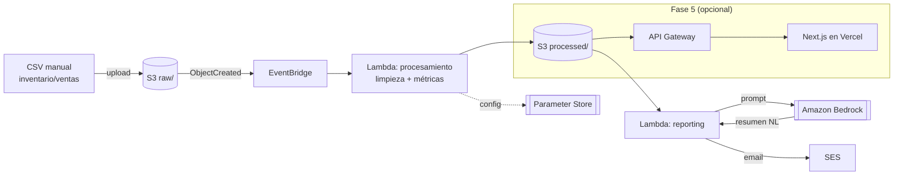

# VintedLens

Pipeline serverless en AWS para ingesta, procesamiento y reporting del
inventario y las ventas de **LoopVTG**, un negocio de reventa de ropa
vintage activo en Vinted. Convierte un CSV exportado a mano en métricas
de negocio (rotación de inventario, precio medio, tiempo en catálogo) y
un resumen en lenguaje natural generado con IA, entregado por email.

Proyecto de portfolio orientado a Cloud/DevOps, hermano de
**AWS FinOps Monitor** (mismo stack base: Lambda, EventBridge, IAM,
Parameter Store, Terraform, pytest, GitHub Actions) y de **Plendu**
(Next.js + IA), con el que conecta en la Fase 5 opcional.

## Estado del proyecto

✅ **Fase 1 completada** — repo, Terraform base, bucket S3 desplegado,
formato de CSV definido, guardarraíl de coste activo.
✅ **Fase 2 completada** — Lambda de procesamiento, EventBridge,
Parameter Store, tests con pytest. Verificado de extremo a extremo
contra AWS real.
✅ **Fase 3 completada** — Lambda de reporting, resumen en lenguaje
natural con Bedrock, envío por SES. Verificado de extremo a extremo:
email real recibido con un resumen generado por IA a partir de las
métricas.
🚧 **Fase 4 siguiente** — CI/CD con GitHub Actions, linting,
cobertura de tests, README final.

## Por qué este proyecto

LoopVTG necesita saber qué se vende, a qué velocidad y a qué precio,
sin depender de la analítica limitada que ofrece Vinted. En vez de
montar un dashboard suelto, lo planteo como un pipeline de datos
serverless real: sirve como caso de uso de negocio genuino y, a la
vez, como proyecto de portfolio para demostrar diseño de arquitectura
en AWS, IaC y buenas prácticas de ingeniería.

## Arquitectura



### Flujo

1. **Origen**: CSV de inventario/ventas con formato propio (definido en
   este repo). Es la fuente de verdad manual — no hay integración con
   la API de Vinted (ver decisión más abajo).
2. **Ingesta**: subida manual del CSV a un bucket S3, prefijo `raw/`.
3. **Procesamiento**: un evento `ObjectCreated` en EventBridge dispara
   una Lambda que limpia los datos y calcula métricas (rotación,
   precio medio, tiempo en catálogo). La configuración (umbrales,
   parámetros de cálculo) vive en Parameter Store.
4. **Almacenamiento**: los datos limpios y las métricas se guardan en
   el mismo bucket, prefijo `processed/`.
5. **Reporting**: una segunda Lambda genera un resumen periódico,
   pide a Amazon Bedrock un resumen en lenguaje natural de los
   resultados (p. ej. *"la rotación de vaqueros bajó un 15% este mes,
   revisa el precio en esa categoría"*) y lo envía por email vía SES.
6. **IaC**: toda la infraestructura en Terraform, tests con pytest,
   CI/CD con GitHub Actions.
7. **(Opcional, Fase 5)**: los datos procesados se exponen vía API
   Gateway y se consumen desde un frontend ligero en Next.js
   desplegado en Vercel, reutilizando patrones de Plendu.

## Decisiones y por qué

**CSV como fuente de verdad, no la API de Vinted.**
Vinted no ofrece una API pública y estable para exportar
inventario/ventas; las alternativas son scraping o servicios de
terceros poco fiables, y ninguna encaja en un proyecto que quiero
mantener en producción de forma sostenible. El CSV es una interfaz
estable que controlo yo: si en el futuro aparece una fuente de datos
mejor (export oficial, herramienta de terceros fiable), solo cambia
quién genera el CSV, no el pipeline.

**Amazon Bedrock en vez de OpenAI para el resumen en lenguaje natural.**
Ahora mismo me estoy certificando en AWS CCP y AZ-900, así que quiero
practicar con servicios de IA nativos de AWS en vez de reutilizar
OpenAI (que ya uso en Plendu). Además da variedad real de stack entre
mis dos proyectos de portfolio: Plendu integra IA en un SaaS Next.js;
VintedLens la integra dentro de una arquitectura serverless AWS.

**Serverless (Lambda + EventBridge) en vez de un servidor siempre
activo.** La carga es esporádica (una subida de CSV cada cierto
tiempo, un reporting periódico), así que un servidor 24/7 sería coste
desperdiciado. Lambda + EventBridge además encajan con el patrón ya
usado en AWS FinOps Monitor, manteniendo coherencia de stack entre
proyectos.

**Terraform + pytest + GitHub Actions desde el principio.** El
objetivo es un repo que se pueda desplegar y verificar sin pasos
manuales ocultos, como se esperaría en un entorno de trabajo real.

**Un solo bucket S3 con prefijos `raw/` y `processed/`, no dos
buckets.** A esta escala (un archivo cada cierto tiempo) dos buckets
solo añadirían nombres que gestionar sin beneficio real. Un bucket con
prefijos simplifica el IAM y las políticas, y sigue permitiendo
filtrar por prefijo en las notificaciones de EventBridge (Fase 2).

**Budget de AWS con alerta desde el primer céntimo, no a fin de mes.**
El objetivo explícito es coste cero. Casi todo el stack (Lambda,
EventBridge, S3, Parameter Store estándar, SES, CloudWatch Logs) cae
en el always-free tier a este volumen de uso; la única pieza que no
tiene free tier perpetuo es **Amazon Bedrock** (Fase 3), que se paga
por token aunque sea céntimos. En vez de confiar en revisar la
consola de facturación, `aws_budgets_budget` (`terraform/budget.tf`)
manda un email en cuanto aparece cualquier cargo real (umbral al 1%
de un límite de 1 USD) y otro si el gasto previsto del mes va a
superar ese límite.

**Lambda sin dependencias de terceros, solo `boto3`.** El
procesamiento (parsing de CSV, validación, cálculo de métricas) es
lógica sencilla que la librería estándar de Python resuelve sin
necesidad de pandas. Evitarlo mantiene el paquete de despliegue
pequeño, sin paso de `pip install` antes de empaquetar, y sin el
cold-start extra que arrastra una dependencia pesada.

**`terraform-deploy` con `PowerUserAccess` + `IAMFullAccess`, no una
política a medida por recurso.** El objetivo inicial era una política
mínima solo para lo que cada fase necesita, pero crear el rol de la
Lambda requiere `iam:CreateRole`/`iam:PutRolePolicy`, que
`PowerUserAccess` bloquea a propósito. Para una cuenta personal de un
solo desarrollador, mantener una política de IAM recortada y
actualizarla en cada fase añade fricción sin beneficio de seguridad
real: el límite que importa aquí es no usar el usuario root a diario
y tener MFA en él, no la granularidad de `terraform-deploy`. Queda
anotado por si el proyecto creciera a un entorno multi-persona, donde
sí compensaría.

**El bucle EventBridge → Lambda no puede autodispararse.** La regla
filtra explícitamente por prefijo `raw/`; la Lambda solo escribe en
`processed/`. Así, sus propias escrituras nunca generan un nuevo
evento que la vuelva a disparar — sin esto, un fallo de diseño
trivial podría convertirse en un bucle de invocaciones sin fin (y
coste sin fin).

**`ssm:GetParametersByPath` necesita el recurso exacto, no solo el
comodín.** Durante la verificación end-to-end la Lambda fallaba con
`AccessDeniedException` pese a que la política incluía
`arn:.../parameter/vintedlens/dev/processing/*`. El motivo: IAM
evalúa `GetParametersByPath` contra la ruta exacta que se pide (sin
`/*` al final), mientras que `GetParameter` evalúa cada parámetro
hijo. Hace falta el recurso exacto **y** el comodín en la misma
política — con solo uno de los dos, falla. Documentado en
`terraform/lambda_processing.tf` para no repetir el error en futuras
Lambdas que lean Parameter Store.

**Claude Haiku 4.5 en vez de un modelo Nova.** El plan inicial era
Amazon Nova Micro por ser el más barato de Bedrock, pero no aparecía
como disponible en la cuenta/región al comprobarlo en la consola. Se
optó por Claude Haiku 4.5 ($1,10 / $5,50 por millón de tokens):
suficientemente barato para resumir unas pocas métricas (céntimos al
mes con cadencia semanal) y con disponibilidad confirmada en
`eu-west-1`.

**Los modelos de Anthropic en Bedrock no se invocan con el ID del
modelo directamente.** Hacen falta dos cosas que no son evidentes
desde la documentación de alto nivel:
1. Un **inference profile** (`eu.anthropic.claude-haiku-4-5-...`, no
   `anthropic.claude-haiku-4-5-...` a secas) — la invocación on-demand
   directa del modelo base no está soportada para este modelo. El
   prefijo `eu.` mantiene el tráfico dentro de la UE (Fráncfort,
   Estocolmo, Milán, España, Irlanda, París) en vez de enrutar
   globalmente.
2. La política IAM necesita permiso **tanto** sobre el ARN del
   inference profile **como** sobre el ARN del modelo base (con
   comodín de región, ya que el profile puede enrutar a cualquiera de
   esas regiones EU) — solo el profile no basta.
3. Un paso de cuenta, aparte de "Model access": Anthropic exige
   rellenar un formulario de "caso de uso" (`PutUseCaseForModelAccess`
   en la API de Bedrock) antes de la primera invocación. No aparece
   como un formulario obvio en la consola; se puede rellenar por API
   pasando `companyName`, `companyWebsite`, `intendedUsers` (código
   numérico: `"0"` interno / `"1"` externo), `industryOption` y
   `useCases` como JSON en base64.

**SES en modo sandbox, remitente = destinatario.** Una cuenta nueva
empieza en sandbox (solo se puede enviar a direcciones verificadas).
Como el informe es para un único destinatario (uno mismo), no hay
motivo para pedir salir del sandbox: verificar una sola identidad de
email y usarla como origen y destino del envío es suficiente y evita
un trámite adicional con AWS.

**Informe semanal por defecto, comparando con el anterior cuando
existe.** La Lambda de reporting no reacciona a cada CSV subido (eso
generaría un email por archivo); una regla EventBridge programada
(`rate(7 days)`, configurable) dispara el resumen periódico. Si hay
al menos dos snapshots de métricas en `processed/`, calcula el delta
de rotación y precio medio por categoría entre el más reciente y el
anterior, y se lo pasa a Bedrock para que lo mencione en el resumen
("bajó un X%"); en el primer informe, sin histórico, genera un
resumen del estado actual sin comparación.

## Plan de fases

El trabajo avanza de forma intermitente; cada fase termina en un
estado estable y funcional, sin depender de tiempo continuo.

- [x] **Fase 1 — Fundación**: estructura del repo, Terraform base,
  bucket S3 `raw/`, formato de CSV definido, ingesta simple. README
  con arquitectura y decisiones.
- [x] **Fase 2 — Procesamiento**: EventBridge + Lambda de limpieza y
  cálculo de métricas. Parameter Store para configuración. Tests con
  pytest. Bucket `processed/`.
- [x] **Fase 3 — IA + Reporting**: integración con Bedrock para el
  resumen en lenguaje natural. Lambda de reporting + envío por SES.
- [ ] **Fase 4 — CI/CD y calidad**: GitHub Actions completo (tests +
  despliegue Terraform), linting, cobertura de tests, documentación
  final del README, diagrama de arquitectura actualizado.
- [ ] **Fase 5 (opcional)** — Dashboard: API Gateway + frontend
  Next.js en Vercel, conectando con Plendu.

Las fases 1-4 son el proyecto completo para portfolio/CV. La fase 5
es prescindible.

## Estructura del repositorio

```
VintedLens/
├── terraform/
│   ├── versions.tf    # Terraform + providers requeridos
│   ├── providers.tf   # Provider AWS + default_tags
│   ├── variables.tf   # project / environment / owner / aws_region
│   ├── locals.tf      # Tags comunes
│   ├── s3.tf                    # Bucket de datos (raw/ + processed/)
│   ├── state.tf                 # Bucket de estado remoto de Terraform
│   ├── budget.tf                # Alerta de coste (guardarraíl de gasto cero)
│   ├── parameter_store.tf       # Config de procesamiento y reporting
│   ├── lambda_package.tf        # Zip de código compartido por las Lambdas
│   ├── lambda_processing.tf     # Lambda de procesamiento + rol IAM + log group
│   ├── eventbridge.tf           # Trigger raw/ -> EventBridge -> Lambda
│   ├── reporting.tf             # Lambda de reporting + SES + rol IAM + log group
│   ├── reporting_schedule.tf    # Disparo periódico (EventBridge programado)
│   ├── terraform.tfvars.example  # Plantilla de variables locales
│   └── outputs.tf               # Nombres/ARNs de buckets y Lambdas
├── data/
│   ├── schema.md       # Formato del CSV de inventario/ventas
│   └── samples/
│       └── inventory_sample.csv
├── src/
│   ├── processing/  # Lambda de procesamiento (parsing, métricas, handler)
│   └── reporting/   # Lambda de reporting (deltas, prompt, Bedrock, SES)
├── tests/                # Tests pytest (funciones puras + integración con moto)
├── pyproject.toml        # Config de pytest
├── requirements-dev.txt  # Dependencias de test (pytest, moto)
├── .github/workflows/    # CI/CD (Fase 4)
├── .gitignore
└── README.md
```

Las carpetas se crean cuando tienen contenido real; `.github/workflows/`
aparece en el árbol como estructura prevista hasta que llegue la Fase 4.

## Formato del CSV

El contrato de entrada del pipeline está documentado en
[`data/schema.md`](data/schema.md), con un ejemplo en
[`data/samples/inventory_sample.csv`](data/samples/inventory_sample.csv).

## Infraestructura (Terraform)

Requiere Terraform >= 1.11 (por el locking nativo del backend S3) y
credenciales AWS configuradas.

```bash
cd terraform
cp terraform.tfvars.example terraform.tfvars   # y rellena tu email real
terraform init
terraform plan
terraform apply
```

`terraform plan` se ejecuta siempre antes de `apply`, nunca se salta
este paso.

**Estado remoto**: `terraform.tfstate` vive en un bucket S3 dedicado
(`vintedlens-dev-tfstate-*`), versionado y cifrado, separado del
bucket de datos porque el estado puede contener valores sensibles y
tiene un ciclo de vida distinto. El locking usa el mecanismo nativo
de S3 (`use_lockfile`, Terraform >= 1.11) en vez de una tabla
DynamoDB — un recurso menos que mantener sin perder protección contra
`apply` concurrentes.

## Subir un CSV (ingesta manual, Fase 1)

```bash
aws s3 cp data/samples/inventory_sample.csv \
  s3://<data_bucket_name>/raw/inventory_$(date +%Y%m%d).csv \
  --profile <tu-perfil-aws>
```

`<data_bucket_name>` es el output `data_bucket_name` de `terraform
apply`. Esa subida dispara automáticamente el procesamiento vía
EventBridge: en segundos aparecen `<basename>_clean.csv` y
`<basename>_metrics.json` en `processed/`.

## Procesamiento (Fase 2)

La Lambda (`src/processing/`) valida cada fila del CSV contra
`data/schema.md` y calcula, por categoría y en global:

- **Precio medio**: media de `listing_price` (publicado) y de
  `sale_price` sobre lo vendido.
- **Tiempo en catálogo**: media de `sold_date - listed_date` en días,
  solo sobre artículos vendidos.
- **Rotación** (`sell_through_rate`): `vendidos / (vendidos +
  listados + reservados)`. Se excluye `removed` del denominador a
  propósito — un artículo retirado ya no compite por venderse, así
  que incluirlo penalizaría categorías donde se despublica por
  motivos ajenos a la demanda (cambio de temporada, error de
  publicación). Categorías con `sell_through_rate` por debajo del
  umbral de Parameter Store (`0.3` por defecto) se marcan
  `low_rotation: true`.

Las filas que incumplen el esquema (categoría no reconocida, fechas
inconsistentes, `sold` sin `sale_price`, etc.) no abortan el batch:
se registran en `row_errors` dentro del JSON de salida y el resto del
CSV se procesa igual.

### Tests

```bash
python -m venv .venv
./.venv/Scripts/pip install -r requirements-dev.txt   # Windows
# source .venv/bin/activate && pip install -r requirements-dev.txt  # Linux/Mac
python -m pytest
```

La lógica de parsing/métricas se testea como funciones puras, sin
AWS de por medio. El handler completo se testea con `moto`
(S3 mockeado en memoria), sin tocar la cuenta real.

## Reporting (Fase 3)

Una regla EventBridge programada (semanal por defecto) dispara la
Lambda de reporting (`src/reporting/`), que:

1. Lista `processed/` y coge el `*_metrics.json` más reciente (y el
   anterior, si existe, para calcular deltas).
2. Construye un prompt con las métricas, los deltas y una instrucción
   de resumen en español, máximo 150 palabras.
3. Se lo pasa a Bedrock (Claude Haiku 4.5 vía Converse API) y recibe
   el resumen en lenguaje natural.
4. Lo envía por email vía SES.

### Requisitos únicos (una sola vez por cuenta AWS)

Antes de que la Lambda de reporting funcione hacen falta dos pasos
manuales que Terraform no puede hacer por ti:

1. **Verificar el email de SES**: `terraform apply` dispara el envío
   de un correo de verificación a `report_email`; hay que confirmarlo
   (revisa spam/promociones si no llega a la bandeja principal).
2. **Rellenar el formulario de caso de uso de Anthropic**: sin él,
   Bedrock devuelve `ResourceNotFoundException` con el mensaje *"Model
   use case details have not been submitted for this account"*. Se
   rellena una sola vez por cuenta, vía API:

```bash
python - <<'EOF'
import base64, json
form = {
    "companyName": "...",
    "companyWebsite": "...",
    "intendedUsers": "0",  # "0" interno, "1" externo
    "industryOption": "Retail",
    "otherIndustryOption": "",
    "useCases": "...",
}
print(base64.b64encode(json.dumps(form).encode()).decode())
EOF
# aws bedrock put-use-case-for-model-access --form-data <salida de arriba> --region eu-west-1
```

AWS avisa de que la propagación puede tardar hasta 15 minutos.

### Tests

Mismo comando que en Fase 2 (`python -m pytest`): `summarizer.py`
(deltas y construcción del prompt) se testea como funciones puras;
el handler se testea con `moto` para S3, y con dobles de prueba
(monkeypatch) para Bedrock y SES en vez de depender de que `moto` los
simule fielmente.

## Stack técnico

AWS Lambda · Amazon EventBridge · Amazon S3 · AWS Systems Manager
Parameter Store · Amazon Bedrock · Amazon SES · IAM · Terraform ·
Python + pytest · GitHub Actions · (opcional) Next.js + API Gateway

## Proyectos relacionados

- **AWS FinOps Monitor** — monitorización de costes AWS con el mismo
  stack serverless base.
- **Plendu** — SaaS en Next.js con IA (OpenAI gpt-4o-mini vision), al
  que VintedLens se conecta en la Fase 5 opcional.

*(Enlaces pendientes de añadir cuando los repos estén publicados.)*
