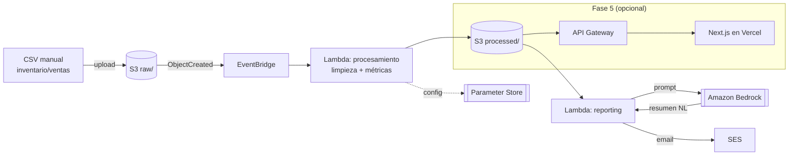

# VintedLens

Pipeline serverless en AWS para ingesta, procesamiento y reporting del
inventario y las ventas de **LoopVTG**, un negocio de reventa de ropa
vintage activo en Vinted. Convierte un CSV exportado a mano en métricas
de negocio (rotación de inventario, precio medio, tiempo en catálogo) y
un resumen en lenguaje natural generado con IA, entregado por email.

Proyecto de portfolio orientado a Cloud/DevOps, hermano de
**AWS FinOps Monitor** (mismo stack base: Lambda, EventBridge, IAM,
Parameter Store, Terraform, pytest, GitHub Actions) y de **Plendu**
(Next.js + IA), con el que conecta en la Fase 5 opcional.

## Estado del proyecto

✅ **Fase 1 completada** — repo, Terraform base, bucket S3 desplegado,
formato de CSV definido, guardarraíl de coste activo.
🚧 **Fase 2 siguiente** — procesamiento con EventBridge + Lambda.

## Por qué este proyecto

LoopVTG necesita saber qué se vende, a qué velocidad y a qué precio,
sin depender de la analítica limitada que ofrece Vinted. En vez de
montar un dashboard suelto, lo planteo como un pipeline de datos
serverless real: sirve como caso de uso de negocio genuino y, a la
vez, como proyecto de portfolio para demostrar diseño de arquitectura
en AWS, IaC y buenas prácticas de ingeniería.

## Arquitectura



### Flujo

1. **Origen**: CSV de inventario/ventas con formato propio (definido en
   este repo). Es la fuente de verdad manual — no hay integración con
   la API de Vinted (ver decisión más abajo).
2. **Ingesta**: subida manual del CSV a un bucket S3, prefijo `raw/`.
3. **Procesamiento**: un evento `ObjectCreated` en EventBridge dispara
   una Lambda que limpia los datos y calcula métricas (rotación,
   precio medio, tiempo en catálogo). La configuración (umbrales,
   parámetros de cálculo) vive en Parameter Store.
4. **Almacenamiento**: los datos limpios y las métricas se guardan en
   el mismo bucket, prefijo `processed/`.
5. **Reporting**: una segunda Lambda genera un resumen periódico,
   pide a Amazon Bedrock un resumen en lenguaje natural de los
   resultados (p. ej. *"la rotación de vaqueros bajó un 15% este mes,
   revisa el precio en esa categoría"*) y lo envía por email vía SES.
6. **IaC**: toda la infraestructura en Terraform, tests con pytest,
   CI/CD con GitHub Actions.
7. **(Opcional, Fase 5)**: los datos procesados se exponen vía API
   Gateway y se consumen desde un frontend ligero en Next.js
   desplegado en Vercel, reutilizando patrones de Plendu.

## Decisiones y por qué

**CSV como fuente de verdad, no la API de Vinted.**
Vinted no ofrece una API pública y estable para exportar
inventario/ventas; las alternativas son scraping o servicios de
terceros poco fiables, y ninguna encaja en un proyecto que quiero
mantener en producción de forma sostenible. El CSV es una interfaz
estable que controlo yo: si en el futuro aparece una fuente de datos
mejor (export oficial, herramienta de terceros fiable), solo cambia
quién genera el CSV, no el pipeline.

**Amazon Bedrock en vez de OpenAI para el resumen en lenguaje natural.**
Ahora mismo me estoy certificando en AWS CCP y AZ-900, así que quiero
practicar con servicios de IA nativos de AWS en vez de reutilizar
OpenAI (que ya uso en Plendu). Además da variedad real de stack entre
mis dos proyectos de portfolio: Plendu integra IA en un SaaS Next.js;
VintedLens la integra dentro de una arquitectura serverless AWS.

**Serverless (Lambda + EventBridge) en vez de un servidor siempre
activo.** La carga es esporádica (una subida de CSV cada cierto
tiempo, un reporting periódico), así que un servidor 24/7 sería coste
desperdiciado. Lambda + EventBridge además encajan con el patrón ya
usado en AWS FinOps Monitor, manteniendo coherencia de stack entre
proyectos.

**Terraform + pytest + GitHub Actions desde el principio.** El
objetivo es un repo que se pueda desplegar y verificar sin pasos
manuales ocultos, como se esperaría en un entorno de trabajo real.

**Un solo bucket S3 con prefijos `raw/` y `processed/`, no dos
buckets.** A esta escala (un archivo cada cierto tiempo) dos buckets
solo añadirían nombres que gestionar sin beneficio real. Un bucket con
prefijos simplifica el IAM y las políticas, y sigue permitiendo
filtrar por prefijo en las notificaciones de EventBridge (Fase 2).

**Budget de AWS con alerta desde el primer céntimo, no a fin de mes.**
El objetivo explícito es coste cero. Casi todo el stack (Lambda,
EventBridge, S3, Parameter Store estándar, SES, CloudWatch Logs) cae
en el always-free tier a este volumen de uso; la única pieza que no
tiene free tier perpetuo es **Amazon Bedrock** (Fase 3), que se paga
por token aunque sea céntimos. En vez de confiar en revisar la
consola de facturación, `aws_budgets_budget` (`terraform/budget.tf`)
manda un email en cuanto aparece cualquier cargo real (umbral al 1%
de un límite de 1 USD) y otro si el gasto previsto del mes va a
superar ese límite.

## Plan de fases

El trabajo avanza de forma intermitente; cada fase termina en un
estado estable y funcional, sin depender de tiempo continuo.

- [x] **Fase 1 — Fundación**: estructura del repo, Terraform base,
  bucket S3 `raw/`, formato de CSV definido, ingesta simple. README
  con arquitectura y decisiones.
- [ ] **Fase 2 — Procesamiento**: EventBridge + Lambda de limpieza y
  cálculo de métricas. Parameter Store para configuración. Tests con
  pytest. Bucket `processed/`.
- [ ] **Fase 3 — IA + Reporting**: integración con Bedrock para el
  resumen en lenguaje natural. Lambda de reporting + envío por SES.
- [ ] **Fase 4 — CI/CD y calidad**: GitHub Actions completo (tests +
  despliegue Terraform), linting, cobertura de tests, documentación
  final del README, diagrama de arquitectura actualizado.
- [ ] **Fase 5 (opcional)** — Dashboard: API Gateway + frontend
  Next.js en Vercel, conectando con Plendu.

Las fases 1-4 son el proyecto completo para portfolio/CV. La fase 5
es prescindible.

## Estructura del repositorio

```
VintedLens/
├── terraform/
│   ├── versions.tf    # Terraform + providers requeridos
│   ├── providers.tf   # Provider AWS + default_tags
│   ├── variables.tf   # project / environment / owner / aws_region
│   ├── locals.tf      # Tags comunes
│   ├── s3.tf          # Bucket de datos (raw/ + processed/)
│   ├── budget.tf      # Alerta de coste (guardarraíl de gasto cero)
│   ├── terraform.tfvars.example  # Plantilla de variables locales
│   └── outputs.tf     # Nombre y ARN del bucket
├── data/
│   ├── schema.md       # Formato del CSV de inventario/ventas
│   └── samples/
│       └── inventory_sample.csv
├── src/                 # Código de las Lambdas (Fase 2+)
├── tests/               # Tests pytest (Fase 2+)
├── .github/workflows/   # CI/CD (Fase 4)
├── .gitignore
└── README.md
```

Las carpetas se crean cuando tienen contenido real; `src/`, `tests/` y
`.github/workflows/` aparecen en el árbol como estructura prevista
hasta que lleguen las fases que las llenan.

## Formato del CSV

El contrato de entrada del pipeline está documentado en
[`data/schema.md`](data/schema.md), con un ejemplo en
[`data/samples/inventory_sample.csv`](data/samples/inventory_sample.csv).

## Infraestructura (Terraform)

Requiere Terraform >= 1.9 y credenciales AWS configuradas.

```bash
cd terraform
cp terraform.tfvars.example terraform.tfvars   # y rellena tu email real
terraform init
terraform plan
terraform apply
```

`terraform plan` se ejecuta siempre antes de `apply`, nunca se salta
este paso. El estado es local en esta fase (no hay backend remoto
configurado todavía, así que `terraform.tfstate` no se pierde solo si
se borra el archivo — no hay copia en S3 hasta que se añada un backend
remoto en una fase posterior).

## Subir un CSV (ingesta manual, Fase 1)

```bash
aws s3 cp data/samples/inventory_sample.csv \
  s3://<data_bucket_name>/raw/inventory_$(date +%Y%m%d).csv \
  --profile <tu-perfil-aws>
```

`<data_bucket_name>` es el output `data_bucket_name` de `terraform
apply`. En la Fase 2, esta subida disparará automáticamente el
procesamiento vía EventBridge.

## Stack técnico

AWS Lambda · Amazon EventBridge · Amazon S3 · AWS Systems Manager
Parameter Store · Amazon Bedrock · Amazon SES · IAM · Terraform ·
Python + pytest · GitHub Actions · (opcional) Next.js + API Gateway

## Proyectos relacionados

- **AWS FinOps Monitor** — monitorización de costes AWS con el mismo
  stack serverless base.
- **Plendu** — SaaS en Next.js con IA (OpenAI gpt-4o-mini vision), al
  que VintedLens se conecta en la Fase 5 opcional.

*(Enlaces pendientes de añadir cuando los repos estén publicados.)*
